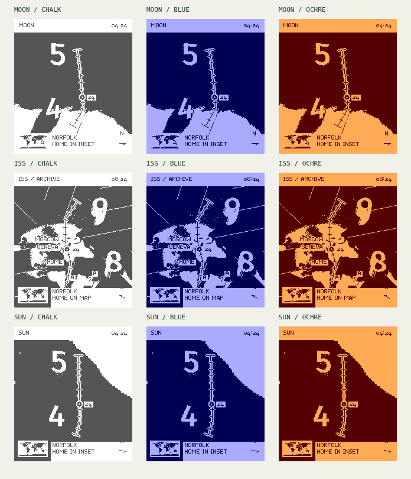

# Groundtrack

**The current hour, the next hour, and a path between them.** Raised numerals sit in a repeated Fuller atlas. Broad areas stay solid; stippling appears only at lighting transitions. Triangle cuts are visible, city labels stay sparse, and a small world inset provides geographic context.

An independent Pebble Time 2 concept, following the pixel-rendering and battery work in [Dymaxion](https://github.com/huntrontrakkr/dymaxion-watch-face). Groundtrack is a working title. This repository contains **browser design studies and a trajectory-cache experiment**, not an installable watchface.



## Try the studies

Use Node 22.12 or newer:

```sh
npm ci
npm run dev
```

Open the URL printed by Vite. **Study 03** is the default: a nonlinear Gray–Fuller projection in a repeated triangular atlas, with Sun, Moon or an archived ISS ground track. The view stays between two consecutive hour stations. Three pairs of inks, an optional secondary Sun/Moon path, city lights, an example home and a world locator let us explore the direction without adding a wide overview.

**Study 02** remains at `/study-02.html`: rounded hour towers above a perspective globe, three materials, Sun/Moon tracks and afternoon/sunset/night observations. **Study 01** remains at `/study-01.html`: the initial landscape, oblique and globe exploration with the archived ISS. All three studies remain frozen until you interact. Home is an explicitly selected example; no location or motion sensor is used.

Read [the unfolded atlas notes](docs/STUDY-03.md), [the sculptural globe notes](docs/STUDY-02.md), [the first study's research](docs/DESIGN.md), and [the battery architecture](docs/ENERGY.md).

## Data and light

Sun and Moon positions use Astronomy Engine. The same calculated Sun supplies directional lighting and volume-shadow geometry. Towers are deliberately exaggerated artwork; roofs, counters and small shadow penumbras receive explicit display treatments for legibility. Coastlines contain no terrain elevations. The compass indicates geographic north at the body's map location, not the wearer's heading.

Study 03 uses [Philippe Rivière's public-domain Gray–Fuller triangle transform](https://observablehq.com/@fil/buckminster-fullers-triangle-transformation). Its repeated layout is not the canonical Airocean net. Five faces meet at an icosahedral vertex, six in a flat triangle grid: incompatible joins are therefore marked as cuts. Paths break and resume beside matching letters. It does not claim a globally seamless map.

ISS uses Satellite.js with its published June 5, 2019 example TLE, is labeled `ARCHIVE`, and refuses extrapolation beyond a day from that epoch. There is no live satellite catalog or background polling. Cities use Natural Earth public-domain data; their lights are symbolic, limited night-side markers.

## Verification and measurement

```sh
npm test
npm run measure
npx playwright install chromium
npm run test:browser
npm run build
```

On Linux, Playwright may also need `npx playwright install-deps chromium`. Browser tests start and stop their own servers; `GROUNDTRACK_URL` can point them at an existing dev or production preview. CI checks all three pages and produces a downloadable static preview. It does not publish a watchface.

Tests cover Fuller forward/inverse geometry and cuts, two-hour-station framing, exact two-ink pixels, projection and horizon behavior, time-zone transitions, compass direction, sunlight and volume shadows, 189 rendering combinations across all three studies, all 24 hour numerals, RGB222 pixels, cache reuse, controls, and 320/390-pixel mobile layouts.

The initial six-hour trajectory-cache experiment uses **1,106 bytes** for two-minute ISS knots and **242 bytes each** for ten-minute Sun/Moon knots. The largest sampled extra interpolation/quantization error was **0.098 pixel at a 400-pixel orthographic globe radius**. This is neither total orbital accuracy nor a bound for the new perspective camera. See [the recorded measurements](docs/trajectory-measurements.json).

Studies 02 and 03 cache geography and tower geometry within an hour, then use the selected minute for solar lighting and shadows. They perform no idle redraws. Native CPU cost, memory use, and electrical battery savings have **not** been measured. The larger shadows need profiling before being part of an installable face.

## Repository map

| Location | Purpose |
| --- | --- |
| `src/fuller.js`, `src/unfold.js` | Nonlinear face transform and explicit geographic cuts |
| `src/atlas-camera.js`, `src/atlas-render.js` | Focused hour framing, two-ink relief and geographic context |
| `src/art-camera.js` | Track-aligned perspective and geographic north |
| `src/art-light.js` | Solar rays and solid-numeral shadow intersections |
| `src/art-render.js` | Native-pixel sculptural rendering and geometry caches |
| `src/ephemeris.js` | Sun/Moon astronomy and bounded historical ISS propagation |
| `src/render.js` | Original orbital study and shared bitmap utilities |
| `src/trajectory.js` | Packed trajectory experiment with expiry handling |
| `tools/` | Reproducible land, dither, font, and trajectory generators |
| `docs/` | Research, architecture, measurements, and visual proofs |

The quarter-degree land atlas is a 129,600-byte flash/resource candidate; a native port must not load it wholesale into watch RAM. No Dymaxion app identity, credentials, or store release workflow is reused.

Project code: Apache-2.0. Natural Earth: public domain. Fira Sans and its derived numeral masks: SIL OFL 1.1. Other dependency and reused Dymaxion notices are in [NOTICE](NOTICE).
