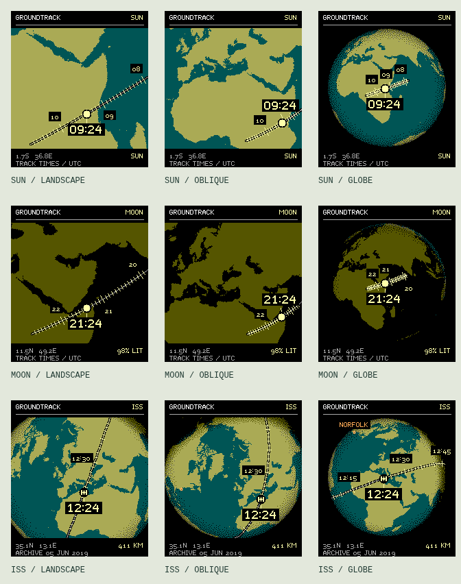

# Groundtrack

**A clock drawn across the Earth.** A body's ground track becomes the time scale: hours sit on the landscape, smaller ticks mark the intervals, and the body identifies the present minute.

An independent Pebble Time 2 concept, following the battery and pixel-rendering work in [Dymaxion](https://github.com/huntrontrakkr/dymaxion-watch-face). Groundtrack is a working title. This repository currently contains a **browser design study and a trajectory-cache experiment**, not an installable watchface.



## Try the study

Use Node 22.12 or newer:

```sh
npm ci
npm run dev
```

Open the local URL printed by Vite. Choose Sun, Moon, or the archived ISS orbit; compare the close landscape, oblique, and globe views; scrub one hour either side of the study time. There are three RGB222 palettes, optional day/night shading, three texture choices, city/home marks, and a second independently positioned Sun/Moon marker. Home is an explicit Norfolk example. Nothing requests your location.

The normal hour labels and the exact-time callout always share the selected civil time zone. ISS views add quarter-hour labels because most of a 90-minute orbit is hidden on the far side of a globe. Crowded minute ticks are thinned rather than merged. The study is frozen until you interact with it.

**Data is explicit:** Sun and Moon use Astronomy Engine. ISS uses Satellite.js with its published June 5, 2019 example TLE, is visibly labeled `ARCHIVE`, and refuses to extrapolate more than a day from that epoch. The live CelesTrak endpoint timed out during the initial study. There is no live satellite catalog or background network polling yet.

## Direction

- Let geography be the face, with one fully annotated primary track.
- Keep the camera steady between page changes. Advance the marker once per minute.
- Support a broad phone-side satellite catalog eventually; begin with up to two secondary markers, with distinct shapes as well as colors.
- Treat Sun/Moon ground points separately from artificial satellite propagation. A ground point is not the object's apparent location in your local sky.
- Prefer measured, subtle texture. Dither the surface, leave every time label and marker crisp.
- Add real elevation contours only after the basic face has a measured native rendering budget. Terrain shadows are a later experiment, not a current feature.

Read [the design and research notes](docs/DESIGN.md) and [the battery architecture](docs/ENERGY.md) for the important tradeoffs, including fast orbits, nearly stationary satellites, horizon occlusion, and data expiry.

## Measurement and verification

```sh
npm test
npm run measure
npx playwright install chromium
npm run test:browser
npm run build
```

On Linux, Playwright may also need `npx playwright install-deps chromium`. Browser tests start and stop their own preview server; `GROUNDTRACK_URL` can point them at an already-running dev or production preview.

The initial 6-hour cache study uses signed 16-bit XYZ knots and normalized interpolation. Two-minute ISS knots use **1,106 bytes**; ten-minute Sun and Moon knots use **242 bytes each**. The largest sampled projected error is **0.098 pixel** at a 400-pixel globe radius. That is additional interpolation/quantization error against the same model, **not total orbital accuracy**, and says nothing by itself about electrical power consumption. Results and caveats are saved in [trajectory-measurements.json](docs/trajectory-measurements.json).

Tests cover geographic roundtrips, horizon clipping, dateline interpolation, solar cross-checks, lunar phase, packet corruption/expiry, time-zone transitions, coastlines, 81 rendering combinations, RGB222/monochrome pixels, deterministic drawing, cache reuse, actual controls, and 320/390-pixel mobile layouts. CI runs these checks and produces a downloadable static preview; it does not publish a watchface.

## Repository map

| Location | Purpose |
| --- | --- |
| `src/ephemeris.js` | Sun/Moon astronomy and bounded historical ISS propagation |
| `src/geometry.js` | Globe projection and safe direction interpolation |
| `src/render.js` | Native-resolution watch studies; browser caches |
| `src/trajectory.js` | Packed trajectory experiment, with expired-cache rejection |
| `tools/measure.mjs` | Repeatable accuracy and storage measurement |
| `tools/generate-land.mjs` | Offline Natural Earth raster generation |
| `tools/generate-dither.mjs` | Deterministic periodic void-and-cluster threshold tile |
| `docs/` | Research, architecture, measured results and visual proofs |

The 0.25-degree land atlas is a 129,600-byte **flash/resource candidate**; it must not be loaded wholesale into watch RAM. There is no native Pebble renderer yet, and browser timing/memory cannot validate one. No Dymaxion app identity, publishing credentials, or store release workflow is reused.

Apache-2.0. Natural Earth data is public domain. Dependency and reused Dymaxion code/type notices are in [NOTICE](NOTICE).
