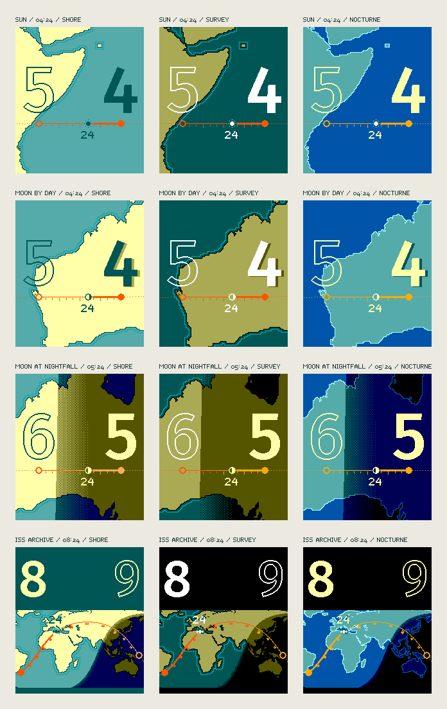

# Groundtrack

**The current hour, the next hour, and a path between them.** The ground route of the Sun, Moon or ISS crosses a flat, north-up map, with the hour's two stations marked by large numerals and the present minute marked on the route. The map is drawn in flat fields of the display's own colors, and the calculated Sun lights it.

An independent Pebble Time 2 concept, following the pixel-rendering and battery work in [Dymaxion](https://github.com/huntrontrakkr/dymaxion-watch-face). Groundtrack is a working title. This repository contains **browser design studies and a trajectory-cache experiment**, not an installable watchface.



## Try the studies

Use Node 22.12 or newer:

```sh
npm ci
npm run dev
```

Open the URL printed by Vite. **Study 05 — Chart** is the default. It is a salvage pass over the earlier studies: north-up geography, a solid current hour and an outlined next hour, a bold elapsed route, and flat RGB222 color fields. Day, twilight and night come from the calculated Sun. Three palettes are provided: Shore, Survey and Nocturne. [The Study 05 notes](docs/STUDY-05.md) list what was kept, what was cut and why, and the open questions.

**Study 04** remains at `/study-04.html`: Shorelight, with shallow relief monuments and spatial color mixing. **Study 03** remains at `/study-03.html`: a two-ink repeated Fuller atlas with geographic context. **Study 02** remains at `/study-02.html`: rounded hour towers above a perspective globe. **Study 01** remains at `/study-01.html`: the initial landscape, oblique and globe exploration. All five studies stay frozen until you interact. No location or motion sensor is used.

Read [the Chart notes](docs/STUDY-05.md), [the Shorelight notes](docs/STUDY-04.md), [the unfolded atlas notes](docs/STUDY-03.md), [the sculptural globe notes](docs/STUDY-02.md), [the first study's research](docs/DESIGN.md), and [the battery architecture](docs/ENERGY.md).

## Data and light

Sun and Moon positions use Astronomy Engine. The same calculated Sun supplies Study 05's day, twilight and night zones and its flat numeral shadows, and the earlier studies' directional lighting and volume-shadow geometry. Towers are deliberately exaggerated artwork; roofs, counters and small shadow penumbras receive explicit display treatments for legibility. Coastlines contain no terrain elevations. The compass indicates geographic north at the body's map location, not the wearer's heading.

Studies 03 and 04 use [Philippe Rivière's public-domain Gray–Fuller triangle transform](https://observablehq.com/@fil/buckminster-fullers-triangle-transformation). Its repeated layout is not the canonical Airocean net. Five faces meet at an icosahedral vertex, six in a flat triangle grid: incompatible joins are therefore marked as cuts. Paths break and resume beside matching marks. It does not claim a globally seamless map.

ISS uses Satellite.js with its published June 5, 2019 example TLE, is labeled `ARCHIVE`, and refuses extrapolation beyond a day from that epoch. There is no live satellite catalog or background polling. Cities use Natural Earth public-domain data; their lights are symbolic, limited night-side markers.

## Verification and measurement

```sh
npm test
npm run measure
npx playwright install chromium
npm run test:browser
npm run build
npm run proofs
```

On Linux, Playwright may also need `npx playwright install-deps chromium`. Browser tests start and stop their own servers; `GROUNDTRACK_URL` can point them at an existing dev or production preview. CI checks all five pages and produces a downloadable static preview. `npm run proofs` renders the Study 05 PNGs in Node, without a browser. It does not publish a watchface.

Tests cover Fuller forward/inverse geometry and cuts, perspective roundtrips, shadow intersections, two-hour framing, native RGB222 output, coherent color mixtures and neutral preservation, clock zones, 243 rendering combinations across all five studies, all 24 hour numerals, cache reuse, controls, and 320/390-pixel mobile layouts. Study 05 adds checks for atlas fidelity after smoothing, numeral clearance from the route, minute-by-minute marker progress, light zones against the solar altitude, and its ISS world band.

The initial six-hour trajectory-cache experiment uses **1,106 bytes** for two-minute ISS knots and **242 bytes each** for ten-minute Sun/Moon knots. The largest sampled extra interpolation/quantization error was **0.098 pixel at a 400-pixel orthographic globe radius**. This is neither total orbital accuracy nor a bound for the new perspective camera. See [the recorded measurements](docs/trajectory-measurements.json).

Studies 02–05 cache geography (and, in 02–04, tower geometry) within an hour, then use the selected minute for solar lighting and shadows. They perform no idle redraws. Native CPU cost, memory use, and electrical battery savings have **not** been measured. The browser supersampling buffers and per-pixel objects are not a native watch architecture. A port needs compact masks, precomputed material ramps and profiling.

## Repository map

| Location | Purpose |
| --- | --- |
| `src/chart-render.js`, `src/chart-app.js` | Study 05: north-up chart, hour stations, route, light zones and palettes |
| `src/fuller.js`, `src/unfold.js` | Nonlinear face transform and explicit geographic cuts |
| `src/relief-render.js`, `src/color-mix.js` | Graphic orbit, shallow landmarks and coherent RGB222 color mixing |
| `src/atlas-camera.js`, `src/atlas-render.js` | Focused hour framing, two-ink relief and geographic context |
| `src/art-camera.js` | Track-aligned perspective and geographic north |
| `src/art-light.js` | Solar rays and solid-numeral shadow intersections |
| `src/art-render.js` | Native-pixel sculptural rendering and geometry caches |
| `src/ephemeris.js` | Sun/Moon astronomy and bounded historical ISS propagation |
| `src/render.js` | Original orbital study and shared bitmap utilities |
| `src/trajectory.js` | Packed trajectory experiment with expiry handling |
| `tools/` | Reproducible land, dither, font, trajectory and proof generators |
| `docs/` | Research, architecture, measurements, and visual proofs |

The quarter-degree land atlas is a 129,600-byte flash/resource candidate; a native port must not load it wholesale into watch RAM. No Dymaxion app identity, credentials, or store release workflow is reused.

Project code: Apache-2.0. Natural Earth: public domain. Fira Sans and its derived numeral masks: SIL OFL 1.1. Other dependency and reused Dymaxion notices are in [NOTICE](NOTICE).
