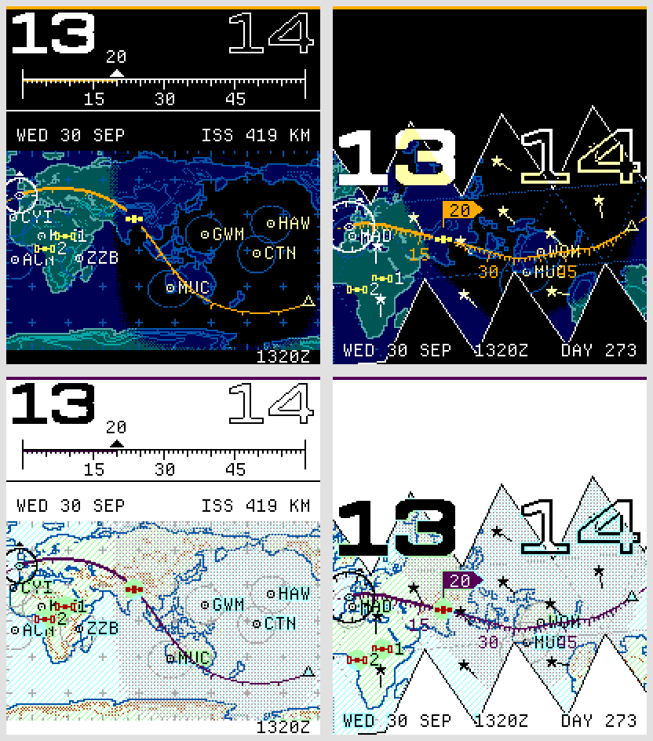

# Companion satellites and triangle orientation

Version 0.6.0 adds two optional satellite markers to both watchfaces. The primary body owns the camera, route, clock and pass forecast; from version 0.6.1, companions carry their three-character catalog identifiers (for example HST or CSS). The primary identifier appears beside the date on every satellite map, replacing the weekday in that same space. These are compact satellite names, not necessarily radio call signs. They move every minute where their ground points lie within that chart. No extra routes or pass forecasts are drawn. Companions can also accompany the Sun or Moon. Plotboard gives global coverage; a zoomed chart or Fuller net can leave a companion outside the visible map.

Each companion uses a separate 32-record satellite ring, outside the primary ring and saved map keys. The phone supplies approximately 24 hours ahead, plus the lead required to cover the current hour, and the watch asks again when less than six hours remain. The primary satellite retains its existing three-day supply. Missing companion segments suppress that marker without preventing the primary chart from building. Settings version 13 adds the companion identifiers after the two catalog numbers; versions 10–12 migrate without losing preferences. The phone refreshes the identifiers on connection. Selection excludes the primary body and duplicate companions.

The Fuller option follows the [USGS true-north convention](https://www.usgs.gov/media/images/north-arrows-us-topo-map): a meridian line with a star at its north end. This is geographic north. The symbol is adapted to a seven-pixel star and a short stem; it uses existing chart ink, without a circular compass dial. It is off by default. The direction is computed independently at each face centre, projected onto that particular unfolded triangle and then through the map's rotation. North varies across a curved projection: the indicator describes its centre, not one constant direction everywhere within the triangle. Centres outside the safe display margins are omitted. Routes and clock figures draw over the symbols.

The north marks use the map's per-pixel lighting layer, so their color follows local night instead of the hour station's night. Tests compare incremental and complete redraws for all 60 minutes, including moving companions and sliding Plotboard maps. A geometry test compares the north direction with an independently sampled latitude meridian on all 20 faces at eight rotations. The simulated watch tests exercise the actual settings, separate satellite storage, phone replies, minute updates and hour changes against the shared renderer. The browser test exercises the new selectors, excludes duplicate choices, toggles north and checks a 320-pixel layout.

To fit the native apps, persistent segment records are read directly into their matching little-endian structures, with compile-time layout guards; settings options are copied in contiguous groups. The renderer's arithmetic is unchanged. Build-size and stack checks remain required.

These previews use the saved test elements at 30 September 2026, 13:20 UTC.

## Shared picker (0.6.2)

Checking a satellite in the catalog or CelesTrak results adds a companion. It does not change the primary. The cards above the catalog identify the primary (route and clock) and up to two companions (markers only). **Make primary** swaps a companion with the previous primary. If that primary was the Sun or Moon, it remains a context marker instead of occupying a satellite slot.

**Replace** names the position being edited and reuses the same catalog and search for it. Choosing an already selected satellite swaps positions; an empty slot cannot take away the primary. Cancel leaves selections intact. At capacity, unchecked satellites are disabled until the user replaces or removes a selection. The Sun and Moon are offered when replacing the primary.

Custom satellites are saved under **Your satellites** and can fill any role. Removing a companion only stops tracking it. **Forget saved satellite** is available for unselected custom entries and removes them from that library. Search results show checkmarks and current roles, and selecting one does not clear the results. The settings preview updates before Save.
