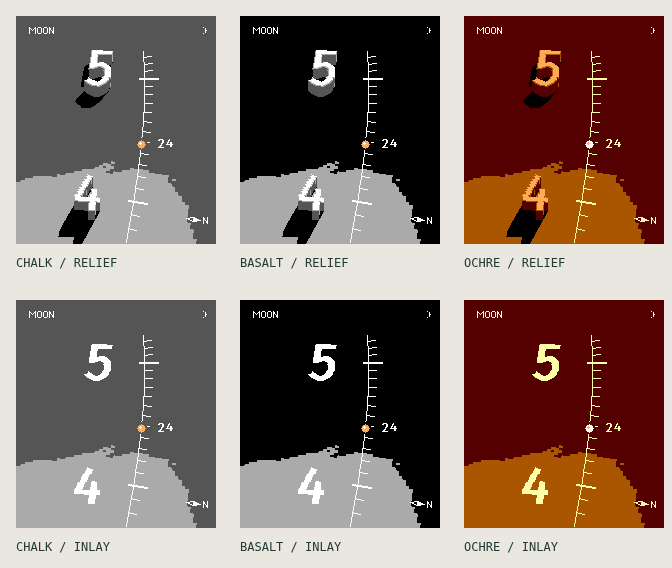

# Groundtrack / study 02 — numeral towers

The face is a sparse landscape with two hour monuments and a path rising through them. At the default moment, **4 begins the hour, 5 ends it, and the small 24 beside the marker reads 04:24**. Five-minute ticks give the path a deliberate rhythm. The camera follows the body's ground track rather than keeping north at the top.

## References and interpretation

Three watchmakers offered useful, distinct lessons:

- [Ressence TYPE 8](https://ressencewatches.com/pages/type-8): separation, empty space, and a small number of strong forms.
- [Mondaine's SBB design](https://uk.mondaine.com/pages/design-sbb): clearly different scales of marks and an immediately recognizable accent.
- [anOrdain Model 1](https://anordain.com/products/model-1-green-fume): lettering informed by maps, with a sense of material depth.

Their product images were inspected as references; no product photos, dial artwork, or proprietary numerals are bundled. The actual digits use Fira Sans Medium under the SIL OFL, rasterized to monochrome masks. The goal is a little sculptural instrument, not a copy of any of these watches.

## Geometry and light

A perspective camera looks at a spherical Earth. Its orientation follows the forward tangent of a Sun or Moon ground track. The two civil-hour stations are placed near the bottom and top, with extra headroom for the far tower. Coastlines, stations, the current marker, and the numeral ground planes share this projection. A camera ray which misses the Earth sees sky.

Each numeral is a solid extrusion of a glyph footprint. Closely spaced projected sections rasterize its visible side surfaces; only the resulting surface fragments are retained in the geometry cache. Rounded edge normals soften the roof lighting at native pixel resolution. This is a stylized normal treatment, not a high-resolution curved architectural mesh. Heights are intentionally exaggerated: these are imaginary monuments, not real buildings or terrain elevation.

**The calculated Sun is the only directional light.** The same astronomical solar vector drives ground illumination, tower highlights, and ground shadows at the selected minute. Shadow rays intersect the spherical ground. An inverse sunlight ray tests the entire extruded footprint, including walls, so the shadow connects back toward the tower instead of appearing as a detached roof silhouette. Shadows are clipped by the viewport, not shortened to fit an artistic direction. Night-side ground receives no direct solar shadow.

An ambient floor, a display response curve, and darker ambient contact shading preserve the shapes on a 64-color screen. Roofs have a minimum ambient tone for reading after sunset. These are display choices, not extra directional lights or a calibrated radiometric simulation. Solar rays are parallel; a finite solar disk and atmospheric scattering are not modeled. Coastlines remain flat: real terrain self-shadowing needs a separate elevation source.

The dated Moon observations compare afternoon, near sunset, and after sunset across Australia. These terms describe sunlight at the shown landscape, not the viewer's civil time zone. The Sun view follows the subsolar ground point, so the tracked point is necessarily in daylight. This is a frozen, scrubbable study, not current telemetry.

## Compass and reading

The small filled vane points toward increasing geographic latitude at its map location. It rotates with the camera projection and is optional. It is a **map compass**, not the wearer's magnetic heading: no accelerometer or magnetometer subscription is needed.

The time scale uses the chosen civil zone, including half-hour and quarter-hour offsets in the camera code. The minute slider follows that zone's hour. Two-digit 24-hour numerals and a small complete-time readout are available under Time & reading. Color never carries the only distinction between an hour, a tick, and the present point.

Sculpted and inlaid treatments are offered in Chalk, Basalt, and Ochre, with three camera angles. The 200×228 buffer contains only opaque RGB222 pixels. Optional stipple stays fixed in screen pixels; glyphs, compass, and ticks are not dithered. The first, broader Sun/Moon/ISS exploration remains at `study-01.html`.

## Battery implications and remaining work

The camera, geographic ray intersections, land mask, glyph geometry, and tower surface fragments stay cached within an hour. Sunlight uses the current selected minute; the study does not substitute a fixed studio light or silently reuse a fifteen-minute-old shadow. There is no animation loop or sensor polling while the page is idle.

This adds shadow and surface shading work compared with study 01. The browser is an art and correctness prototype, not a native power profile. Before a Pebble port, measure cached redraw regions, tower/shadow raster cost, and peak memory. Compare lighting updates at a minute cadence with a pixel-error-triggered cache, using the actual projected shadow rather than an arbitrary time bucket. The earlier 400-pixel orthographic trajectory bound does not validate this closer perspective camera.

Tests cover camera inversion and clipping, upward chronological ordering, fractional time zones and DST, geographic compass direction, actual solar vectors, forward/inverse shadow agreement, side-wall occlusion, 72 display combinations, all 24 hours, day/night controls, geometry cache reuse, zero idle redraws, and narrow mobile layouts. These checks do not measure electrical battery use.
