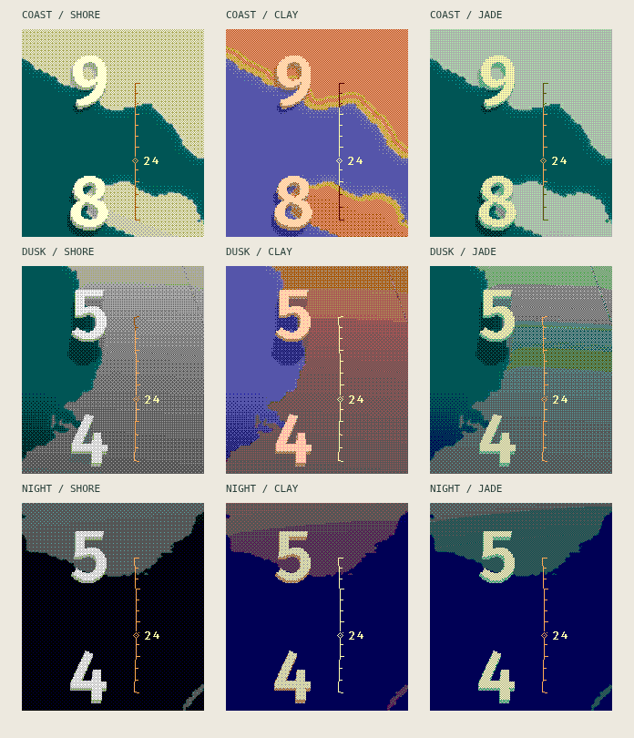

# Study 04 — Shorelight

This study rebuilds the foundation around a landscape, two consecutive hour numerals, and a legible bottom-to-top orbit. The final direction is **graphic and restrained**: flat track, crisp divisions, a simple diamond for the present minute, broad land/water fields, and only a little relief beneath the hour numerals. Cities, home markers, world insets, compass and face-mounted information panels are deliberately deferred.

## Color rather than noise

A continuous material palette is rendered before conversion to RGB222. For each shade, the renderer selects a coherent pair of native colors and a linear-light mixing ratio. Opposing channel directions are rejected: pink and green speckles should not be used merely because their average approximates a neutral. Neutral targets remain neutral. A small, fixed 4×4 ordered screen distributes the two colors. It does not animate or change with the frame number.

The three palettes are Shorelight (stone and teal), Terracotta (warm earth and periwinkle), and Celadon (pale green and deep teal). Broad water fields stay quiet, while shoreline, sunlight and shadow transitions gain intermediate tones. The native-size comparison on the page shows the exact same scene with nearest-color conversion and spatial mixing.

Track lines, ticks, the diamond and minute lettering are painted **after** color mixing, using opaque whole pixels. They have no extrusion, specular highlights, cast shadows or antialiased halo. Their contrast follows the brightness beneath the marks. The underlying landscape never reduces a mark to a broken dither pattern.

## Geography and light

The nonlinear Gray–Fuller transform and explicit cuts from Study 03 remain. A mild projective camera is applied to the unfolded plane; its inverse first undoes that camera, then solves the Fuller inverse. It does not apply affine geographic interpolation to a perspective image.

Natural Earth supplies the real coastline. The narrow nearshore color gradient is decorative material grading, **not measured depth or elevation**. No procedurally invented topography is presented as geography. The landmarks are imagined numerals with about 3.5 display pixels of relief. Their small colored shadows use the actual astronomical Sun. The flat route is independent of this lighting.

Optical correction aligns the numeral plans for reading. Since the resulting tangent basis can be skewed, a dual basis is used for volume/ray intersections. This keeps the physical shadow calculation consistent with the drawn geometry. The browser supersamples the landmarks at 3×, then reduces once to the real 200×228 display before color mixing; this does not increase the watch's resolution.

Moon observations: the Mozambique Channel on September 15, 2026, then approaching sunset on September 18 and night on September 20. The time zone controls the hour numerals, not the Sun. The ISS is still an explicitly dated June 5, 2019 archive with strict epoch limits. Incompatible map joins are quiet creases. Open paired diamonds indicate a cut in the orbit; the current-time diamond additionally has a center pixel.

## Cost and validation

The scene is frozen until an interaction. There are no idle redraws, temporal dithering, continuous orbit animation, location polls or sensor subscriptions. A minute change reuses the camera, ground lookup and numeral geometry. A palette change also reuses the sunlight and shadow mask. The comparison canvases share the finished continuous-color scene.

This remains a browser visual study. The supersampled canvas buffers, per-pixel JavaScript objects and nearest-color search are **not a proposed watch RAM layout or per-minute native implementation**. A watch port would need precomputed material ramps, compact masks and fixed-point geometry, followed by emulator/device profiling. No electrical battery savings are claimed.

Unit checks cover native colors, neutral preservation, luminance reconstruction, stable patterns, coastline distance, shadow penumbra, perspective geographic roundtrips, corrected numeral planes and shadow intersections. Browser checks cover 36 combinations of body/material/mixing/clock format, all 24 hour numerals, every minute position in those hours, marker/landmark separation, clock-zone and reset behavior, day/dusk/night, cache reuse, idle stability, and narrow mobile layouts. Earlier studies keep their own regression checks.

## Art-direction reference

The [generated reference](art-direction/shorelight-concept.png) explored warm stone and cool water before the final request for flatter, cleaner graphics. It is an art-direction image, **not a screenshot or a watch asset**. The functioning scene uses real geometry and code. [Generation mode and full prompt](art-direction/README.md).
