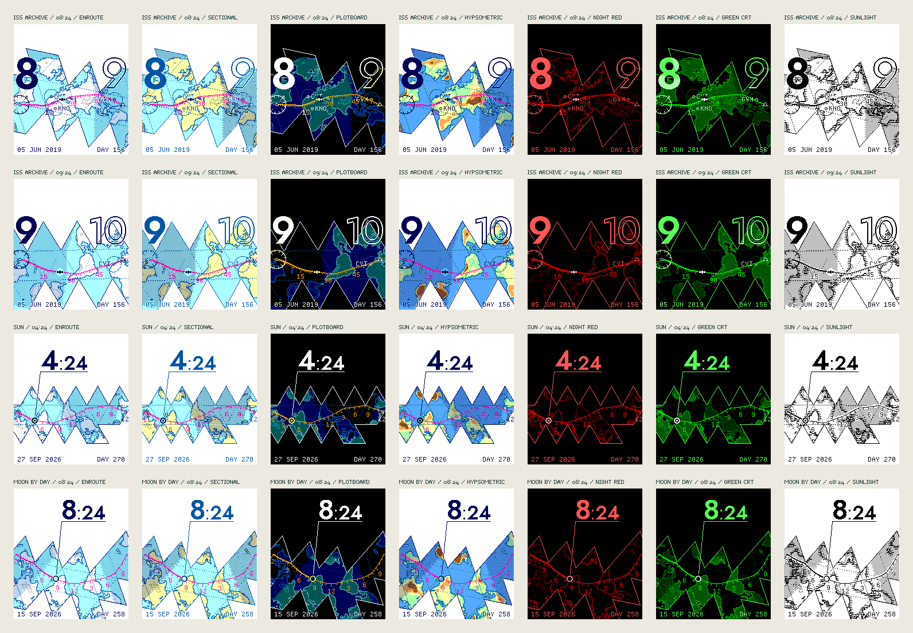

# Study 06 — Enroute

The Study 05 chart, redrawn in the language of aeronautical charts and of NASA's first mission control rooms. The references are the FAA sectional and IFR high-altitude enroute charts, the jet navigation charts of the 1960s, and the world-map plotboards used to follow Mercury, Gemini and Apollo. The goal is elegance through restraint: thin lines, a few inks and one strong figure.


## The chart's vocabulary

- **Relief.** Contour lines, not color bands. There is a solid line every 1,000 m, plus a dotted intermediate contour at 500 m. Heights are smoothed three times before contouring, so the lines read as drawn, generalized contours rather than grid cells. Flat hypsometric tints and two-tone hillshading were tried first; in 64 colors they looked like a school atlas or camouflage (see the exploration below).
- **The continental shelf.** A dotted blue line offshore is the real 200 m depth contour. It replaces Study 05's decorative waterline with data.
- **Graticule.** Small crosses every 5° (30° on the ISS world band). Degree ticks run around the edge of the map like a chart's neatline, with a longer tick every 5°.
- **The route.** The magenta line, which pilots follow on every glass cockpit. It is bold behind the marker, fine ahead and dashed before and after the hour. Ticks mark five minutes, with longer ticks labelled 15, 30 and 45 at the quarters, as on a plotted ground track.
- **Fixes.** This hour's station is a VOR: a hexagon inside a compass rose, with 30° ticks, longer cardinal ticks and a north arrowhead. The next hour is an open triangle, a reporting point. The map is north-up, so the rose shows true north, not magnetic variation.
- **The time scale.** On the Sun and Moon charts the route itself is the scale. The hour's two stations sit exactly 120 px apart, so each minute is exactly two pixels along the magenta line. There is a graduation every minute, longer marks every five and fifteen minutes, and the quarters are numbered 15, 30 and 45 beneath. The body's own symbol is the index moving along it. The two hour figures stand in the chart over their stations at one size and on one baseline: this hour solid over its compass rose, the next outlined over its reporting point. The figures, graduations and symbols read as one drawing. On the ISS world band the same reading is set in a panel above the map, built like an instrument tape: 180 px for the hour, three pixels a minute, tall hour marks under the figures and a solid triangular index, running the way the route runs. An optional **time callout** gives the time in full below the route, labelled the way a chart labels a feature. The minutes are set smaller than the hour on the same baseline, as on a cockpit clock, and the time hangs from a shoulder, the cartographer's elbow leader, that runs back to the body. The leader is cased with a hairline of paper so it crosses relief cleanly. It breaks for lettering, as a printed line does, and takes whichever side keeps it clearest. A pointer with an arrowhead, a VFR-style pennant and a plain dotted line were also tried; at this pixel size the arrowhead and pennant are too small to read, and the dotted line was too plain. The earlier radar-style data block, the minutes raised beside the hour and a separate scale panel over the zoomed charts were all tried and dropped.
- **Experiment: the sliding tape.** On the satellite world band the ruler can instead be a tape (Time scale: Tape). The index stands still in the middle of the panel, a hairline in the route's ink with the solid pointer on the baseline. The minutes and hours run past it at three pixels a minute, future to the right, like a heading tape behind its lubber line or the day strip of a time-slide face. The hour figures ride the tape on their marks: this hour solid, the next outlined, cut off at the edges like any tape. When this hour's mark leaves the left edge, its figure stays pinned there as a sticky label until the next hour's figure pushes it off, so the hour is always readable. With Tape + world the map slides too, centred on the satellite each minute, and the index line runs on, dotted, down through the map to the satellite: one line reads the time and the place. The fixed ruler remains the default. With the world sliding the band is the whole world round, 200 columns to 360°, built once for the hour and turned under the index each minute as a column offset (the route, stations and graticule turn with it; the hour's lead-in and lead-out wrap round and lie beside the hour's own passes, as they do on the Earth).
- **Minute flag.** Optionally (Clock → Minute readout → Minute flag), a staff rises from the body into the space between the route and the hour figures and flies a small pennant with the minutes. The minutes are set in the chart's own 7 px lettering, reversed out of the route's ink. The flag sits under the figures and above the route, so it never touches either. It flies ahead, toward the next hour, and turns back as the next station comes near. On a slow orbit's steep route (GPS) the staff leans out on the figures' side instead, and the flag flies away from the route, so it stays clear of the rose and the minute labels. A double-size version was tried and was blockier and crowded the route. The earlier minute figure and radar-style data block were set in space that belonged to the figures; the flag keeps to the route's own band.
- **Clock.** Figures are 24-hour by default, as on a flight deck; 12-hour remains an option. The callout's time was workshopped in five styles (`docs/screenshots/study-06-numerals-contact-sheet.png`): the hour with a colon and smaller minutes; the same without the colon; four figures at one size with the minutes outlined; minutes in double-size Departure Mono; and smaller minutes in the route's ink. **Four figures** is the page's default: `1424` reads as one time, matches the four-figure times in the margins (`0824Z`, `SR 0648`), and its outlined minutes reuse the chart's own solid-and-outlined pair. The others stay selectable.
- **Date.** The zoomed views print the local date and its day of the year in the bottom margin (`27 SEP 2026 · DAY 270`). The day of the year is how Mission Control's clocks counted days. Between them sits the same moment in Zulu time, UTC as pilots and mission control keep it (`0824Z`), centred in the space the date and day leave. Optionally it gives instead the time in the nautical time zone under the body, with that zone's letter. The zones are 15° wide and lettered A–M east of Greenwich (no J), N–Y west, and Z at Greenwich: `2324I` while QZSS is over Japan, `0824R` over the US East. The Sun's is always close to `1200`, since the Sun stands over noon. The ISS margin keeps its archive date and altitude above the band and sets Zulu time at the right under it.
- **The present.** The body's own symbol: ☉ for the Sun, the Moon in its calculated phase, or a small station for the ISS.
- **The network.** Twenty-four stations of the Mercury (1961–63) and Apollo (1967–75) tracking networks, drawn as circled points with their network codes. Examples include TAN (Tananarive, Madagascar), ZZB (Zanzibar), CRO (Carnarvon) and GDS (Goldstone). When labels would collide, the station earlier in the list wins.
- **Acquisition circles.** On the ISS world band, each station also carries the circle within which a 410 km orbit rises 5° above its horizon, about 15.6° of arc. The circles are computed on the sphere, so they widen toward the poles, as they did on the Mercator plotboards.
- **Home.** The wearer's own place is one more station: an airport with services (a ring with four ticks, as on a sectional) coded HOM. It is placed before the network, so stations give way to it, and drawn last on its own knockout, so neither the route nor a figure can cover it. On the Sun and Moon views the top margin gives the day's rise and set there in local 24-hour time, `HOM SR 0648 · SS 1844`, or `MR`/`MS` for the Moon; `----` stands for a rise or set that does not happen that day, as in polar summer. For a satellite it gives the next pass: `HOM AOS 1434 6M 78°`, the minute it rises 10° above the home horizon, how many minutes it stays up and its highest elevation. During a pass it reads `IN VIEW LOS` with the minute of loss of signal, and `NO PASS` when there is none within the elements' reach. On the world views home also carries its own acquisition circle for the satellite's altitude. Rise and set come from Astronomy Engine; passes are sampled from SGP4 every 20 seconds over the next day and cached. Home is New York by default, one of the study's preset cities, or the browser's location when the viewer asks, rounded to 0.01° and kept in the page only.
- **Tape to route.** The fixed ruler's minutes are even, three pixels each, but the orbit covers the band unevenly: squeezed where it crosses the equator at a slant, stretched where it turns at its highest latitudes. A strip a few pixels deep under the ruler shows how one maps onto the other, in three styles. A **vernier** ticks the route's own minutes under the ruler's, so they bunch and spread against the even ticks above. A **comb** hangs a short stroke from every five minutes of the ruler, leaning toward where that minute falls on the route, so the whole comb fans in or out like streamlines through a nozzle. **Chevrons** point in where the route squeezes the minutes and out where it stretches them, and leave the even stretches blank. Larger versions (transfer lines and streamlines down to a second ruler over the map) were tried first and crowded the gap; at this size the comb reads fastest. All three are optional and off by default.
- **Events.** An event is a compulsory reporting point: a filled triangle on the route at the event's minute, named above with a five-letter name code, as airspace names its waypoints (ICAO's five-letter name codes, such as `BOSOX` or `JIMMY`). The code is made from the event's title and cannot be set by hand: the title's longest word carries it, a tie going to the later word (wade<>Chiles weekly standup is a standup; Flight to Boston is `BOSTN`); vowels are dropped from its end until five letters remain (Dinner is `DINNR`); a word that won't say aloud is cut to its first five (Standup is `STAND`); a short word repeats its last letter (Run is `RUNNN`); and every code keeps a vowel and never more than three consonants in a row, so it can be read out. Codes are unique on the day; a repeat changes its last letter. Every label is the same 35 px wide, which makes room between the hour figures easy to keep. The next hour's open triangle is the optional kind, so the two read as one family. Because the route is the time scale, a meeting can be seen coming as the body moves toward it. On the day strips the whole day's events stand along the strip; on the ISS world band they stand on the orbit. The triangle always shows; the name gives way to the hour figures, the callout, the stations and the margins. On a watch the events would come from the phone's timeline; the study keeps a few of its own, and the page can add and remove them.
- **Type.** The figures are set in Jost (SIL OFL 1.1), a revival of Futura, the face of the Apollo 11 plaque and many mission patches. Jost replaced Fira Sans after a side-by-side test on the face. Barlow (a DIN-style face) was the close second; Michroma was too wide for the figures at this size. The chart lettering (station codes, quarter-hour marks and margin notes) is [Departure Mono](https://github.com/rektdeckard/departure-mono) (SIL OFL 1.1). It is a pixel face drawn on an 11 px grid, so at 11 px every pixel is fully on or off. A double-size Departure minute set directly after the hour looked spindly. On the page, headlines use Michroma (after Microgramma, the lettering of 1960s space hardware), text uses Jost, and small type uses Departure Mono.
- **Figure sets.** Three more sets stand beside Jost (Figures, on the page and in the watch's settings), held to about Jost's widths so they fit the same places: **B612**, drawn for Airbus cockpit displays; **Michroma**, after Microgramma and Eurostile, the lettering of *2001*'s Discovery and of NASA's hardware (its one light weight made bold by thickening its strokes); and **Orbitron**, a geometric face of the space age (all SIL OFL 1.1). (Figures drawn as contour lines, a dot lattice and the DSKY's seven segments, and Jost printed as letterpress, halftone, engraving and stencil, were tried and dropped.) `tools/generate-figures.py` makes them (`data/figures.json`); the watch carries every set in `figures.bin` (each set's table in its header) and reads the chosen set's table for each build. `docs/screenshots/study-06-figures-contact-sheet.png` shows each in the hour figures, a time callout, the world band's tape and a Fuller day.
- **Honest margins.** The ISS view states `ARCHIVE 05 JUN 2019` and the station's altitude, because it is a bounded archive, not live data.
- **Night.** The paper plates print night as a regular dot screen under every symbol. The screen deepens from nothing at sunset to 25% at the end of civil twilight, which is how a printed chart would overprint a tint. Hypsometric and Sunlight do the same. Plotboard and Night red keep flat light zones, and Green CRT draws twilight and night as dark scan lines, every fourth line at dusk and every other line at night. Night red and Green CRT also draw the terminator itself, as the mission control plotboards did. It is traced from the Sun's height at each pixel: a dashed line where the Sun sets and a dotted line where civil twilight ends. Night red, drawn in outlines, also tints its night side with a sparse dot screen.

## Live satellites

The ISS archive view stays, because it works offline and keeps the tests deterministic. Alongside it, the page can now track five satellites live:
- **ISS** and **Tiangong**, the two crewed stations;
- the **Hubble Space Telescope**;
- **Landsat 9**, sun-synchronous, so its passes cross each latitude at the same local time;
- **NOAA-20**, a polar weather satellite.

Choosing *Track now* fetches the satellite's current element set from CelesTrak and checks its checksums. The positions are then propagated with SGP4. Following CelesTrak's usage policy, a satellite's elements are requested at most once every two hours and cached in the browser. Elements are used only within three days of their own epoch. Beyond that the renderer refuses rather than guessing. If the request fails, the page says so; a stale cached copy can still be used if it is within three days. The margin names the element set in use (for example `HST EL 29 SEP 1336Z`), and uncrewed satellites get their own symbol, a body between two panels. *Now* brings any view to the current minute, and the face stays frozen until the next interaction.

On a watch, the phone would fetch and propagate the elements and send the watch compact trajectory knots, as measured in `docs/ENERGY.md`. The watch would never talk to CelesTrak.

This cloud build environment blocks celestrak.org, so the tests replace CelesTrak with an intercepted fixture: the 2019 ISS elements moved to the current epoch. Real requests happen only in a viewer's browser.

## Slow orbits: GPS and QZSS

The Sun and Moon cross the ground at about 15° an hour, and a low orbit at nearly 240°. Between them are orbits that nearly keep pace with the Earth, and they suit the chart:

- **GPS** (BIIF-1, PRN 25) circles in 12 hours at 20,200 km, tilted 55°. Its ground speed is close to the Sun's, but its hour can run any way, often steeply north or south. It is drawn on the hour chart. The hour's two stations are still 120 px apart along the route, north stays up, and each hour figure stands off its station on the route's open side: above a level route, beside a north–south one. The minute marks take the other side.
- **QZSS** (QZS-2, Michibiki) is quasi-zenith: a 24-hour orbit tilted 41°, slightly oval (e 0.075), with perigee in the south. Its sub-point never leaves the western Pacific. It traces a figure-8 over Japan and Australia once a day, its northern loop slow and high over Japan. It is drawn as its whole local day on one north-up chart, with hour marks and every third hour numbered. The track is set to the right, and the time callout stands aside in the open map to its left with its leader run across to the satellite. Where the figure-8 crosses itself, two hours meet, and the later label gives way.

QZSS can also be put on the hour chart (QZSS chart: This hour). An hour covers only a few degrees, so the map zooms far in over Japan or Australia, with the two figures and the minute scale at full size.

Every leader on the face, from the callouts and the day chart's callout to the minute flag's staff, is routed like a circuit trace. A 45° run leaves the body, then a straight horizontal or vertical run reaches the target, with no other angle.

The study uses **nominal** element sets for both: textbook orbits of each class generated in `src/nominal.js`, not measured elements, and the page says so. Live tracking of the real GPS BIIF-1 and QZS-2 (under Live satellites) replaces them with CelesTrak elements where the network allows. The catalogue numbers (36585 and 42738) should be checked against CelesTrak's listing when live tracking is first tried. The home station gives the next pass for both: from New York, GPS is often in view for hours, while QZSS never rises.

## Spike: rolling Fuller

Studies 03 and 04 used a fixed icosahedral net. A flat triangle grid puts six triangles around every corner, but the icosahedron has only five, so any flat net must cut the Earth somewhere, and routes broke at those cuts. This is geometry, not a rendering fault: a sphere cannot lie flat without stretching or tearing.

The spike (`native/src/c/fuller.c`, once `src/roll.js`; *Projection → Rolling Fuller* on the page) rolls the icosahedron across the plane along the route instead, printing each Gray–Fuller face as it touches down, so the route never meets a cut. A first version then filled the whole screen outward from that strip, an endless tiling. It worked, but the fill order scattered cuts wherever two directions met, and the result looked broken.

The current version is a **floating net**, a true net of the icosahedron grown from the route. The faces the route rolls over come first; then up to two rings of neighbours are added, nearest the middle of the hour first. Each face is printed at most once, so no place ever appears beside a copy of itself, and a face joins only where it truly meets every face already printed beside it. Neighbouring faces are therefore always consecutive on the globe, and the net contains no cuts at all. A satellite's strip is also kept under one lap (the hour plus ten minutes either side, against the ISS's 92-minute orbit), so the route never rolls back over its own faces. Folds inside it are quiet dotted lines, its outline is inked, and the rest of the view is plain paper (or dark glass on the Plotboard). The camera turns the net so the hour runs left to right like a ruler, and the compass rose points to true north, because north is no longer up. On a whole-orbit net only the 2,000 m and 4,000 m contours remain, and only the tracking stations that can hear the satellite during this hour are drawn, each with its acquisition circle.

It suits satellites best. On the Gray–Fuller faces great circles are nearly straight, so an ISS hour, about 240° of orbit, unrolls into a zigzag band of four or five faces, with the orbit as a near-straight graduated line through the middle. Small kinks remain at face edges, because the transform is not exactly gnomonic and the Earth turns beneath the orbit. For the Sun and Moon an hour covers only part of one face, so on the Fuller sheet they show the **whole local day** instead, midnight to midnight. That is 23 or 25 hours across a daylight-saving change. The day rolls out as a band of the net running left to right, with a tick every hour, the hours numbered every three and the two midnights marked longest. The day so far is bold, and the body is the index. A day is too long a scale to read minutes from, so the day strip always carries the time callout, set larger, in the open paper above the net. When the net leaves no room above, the callout hangs below the body instead. Near an equinox the Sun's day is almost a great circle and lies nearly straight. The Moon's, or the Sun's near a solstice, runs well away from the equator, and a circle of latitude unrolls as an arc, the way a cone flattens into a fan. The view therefore fits the whole arc, not just its chord.



The ground is **pre-projected**, as Dymaxion pre-projects its net. Every sheet is made of the same 20 faces, each placed by a rotation, scale and shift, so each face is sampled once, offline, on a triangular grid of 64 steps an edge (`tools/fuller-pack.mjs`, `public/fuller.bin`, about 100 KB). Each grid point keeps its direction in the face's frame, its land coverage and its relief, averaged over its cell. A pixel's place on its face's grid is an affine function of the pixel, kept in fixed point, and its land, relief and the Sun's height are interpolated between the three nearest points in integers (`src/fuller-ground.js`). Nothing inverts the projection per pixel, so the watch can build a sheet cheaply and draw the same pixels. Against the exact projection, 1 to 2 percent of pixels differ, a coastline or contour one pixel over. GPS's hour zooms in far enough (a face 500 px across) that the grid is too coarse for coastlines, so there land comes from the quarter-degree `land.bin` at the grid's interpolated directions; its relief tints stay the grid's, a little smoother than the exact projection's.


Tests check the following:
- The rolled route never jumps.
- The hour runs horizontally left to right.
- For every hour of the archive day, the net holds no cuts (only folds and its outline) and prints no face twice.
- Every point inside the net inverts to the right place on Earth.

## Plates

| Plate | Reference | Paper | Lines | Type | Route |
| --- | --- | --- | --- | --- | --- |
| **Enroute** (default) | IFR enroute chart | white land, pale water | gray contours, cobalt coast | navy | magenta |
| **Sectional** | VFR sectional chart | cream land, pale water | olive contours, cobalt coast | cobalt | magenta |
| **Console** | 1960s mission control display | teal land, dark water | cyan contours and coast | white | amber |
| **Hypsometric** | jet navigation chart layer tints | green lowland to tan and brown peaks; sea deepens off the shelf | olive contours, cobalt coast | navy | magenta |
| **Night red** | red cockpit lighting | outlines on black; night dotted, with a dashed terminator | dark red contours | light red | red |
| **Green CRT** | mission control console phosphor | green land on black; night in scan lines, with a dashed terminator | green contours and coast | pale green | green |
| **Sunlight** | one-color chart, for bright sun | white, with coastal waterlines on the zoomed charts | dotted black contours | black | black, cased in white; heavier on the Fuller sheets |
| **Blueprint** | an engineer's blueprint | light blue land on mid-blue water; night deepens the blues, with a dashed terminator | pale cyan contours, white coast | white | yellow |
| **Amber** | plasma and early flight displays | dark amber land on black; night dims every ink a step, with a dashed terminator | amber contours and coast | light amber | pale yellow |
| **Airbrush** | the airbrushed shaded relief of the Apollo-era Lunar Astronautical Charts | land modelled by its slope, lit from the northwest in sepia and dithered like an airbrush, on white sea; night a dot screen | none: the light models the relief; dark olive coast | dark brown | deep red |
| **Dot matrix** | a mission wall's lattice of lights | the ground as 4-pixel cells, a dot in each whose size is the height (2×2 lowland, a plus, 3×3 high) and whose colour dims through dusk to night; the sea a faint point a cell | none: the dots are the coast and relief | white | amber |
| **Odyssey** | *2001: A Space Odyssey*: the opening alignment, Discovery's displays and HAL 9000 | a dark Earth on black: grey land by day, the dawn blazing gold along the terminator (twilight the brightest ground), night black with grey coasts; the Sun drawn as HAL's eye | grey contours, gold at dawn | white | white |

## Data

- **Relief:** `public/relief.bin` is a quarter-degree grid that lines up cell for cell with `public/land.bin` (1,036,800 bytes); the watch and the study draw from the levels between the plates' thresholds, packed in tiles (`tools/map-pack.mjs`, 51 KB with coarser copies for the wider views), which moves a contour by a pixel here and there. It uses square-root codes: 0–63 is depth to 11,000 m and 64–255 is height to 8,850 m. `npm run generate:relief` rebuilds it from the AWS Open Data Terrain Tiles (Tilezen Joerd) at zoom 3. At that zoom, the tiles' own source headers list only NOAA ETOPO1 and USGS GMTED2010, both in the public domain. The generator records those headers in `data/relief.json` and refuses to write the grid if any other source appears. Checks cover the Tibetan plateau, the Altiplano, the Amazon basin, the Netherlands, the Mariana Trench, and agreement with the coastline atlas, where 99.7% of land cells have non-negative height. The grid is generalized and **not for navigation**.
- **Tracking stations:** `data/tracking-stations.json` holds positions rounded to about 0.1° from public histories of the networks. They place a symbol, not a survey point.
- **Everything else** carries over from Study 05: Astronomy Engine for the Sun and Moon, the bounded 2019 Satellite.js ISS archive, Natural Earth coastlines, and the Dymaxion bitmap tooling. The type is Jost, Michroma and Departure Mono, all SIL OFL 1.1.

## The exploration

Six terrain treatments were compared on four scenes: the Horn of Africa, the Himalaya, the Andes coast and Western Australia. These were 64-color layer tints, contours only, tints with contours, two-tone shaded relief, white-paper contours, and tints with shading. Layer tints turned into loud bands of lime, orange and brown. Shaded relief at a quarter-degree read as camouflage. Contours on plain paper were the only treatment that stayed quiet at 1× and still showed where the high ground is.

Several other choices were tried and then cut back:
- Interior graticule crosses were reduced from 7 to 5 pixels.
- A coordinate line along the bottom edge was dropped as clutter.
- The first figure size (104 px) was reduced to 80 px.
- A flat night zone on paper was replaced by the dot screen.

## Cost

In Node on a desktop CPU, a new hour takes about 120 ms (projection, coast, relief smoothing), a new minute about 25 ms, and a plate change about 20 ms. **These are not watch measurements.** The relief grid is also too large to load into watch RAM. A native design would let the phone render the hour's base chart (coast, contours, shelf and graticule) into a compact indexed bitmap and send it once an hour. The watch would then draw only the route, marker, stations, night screen and figures each minute. None of this has been profiled, and no battery claim is made.

## Open questions

- One-pixel gray contours and a 25% dot screen need checking on the reflective display, in daylight and under the backlight.
- The tracking-station layer may belong behind a setting. It delights on the ISS band but is optional on the Sun and Moon faces.
- The compass rose could show magnetic variation from a world magnetic model, as real VOR roses do. That would take an extra model and would not help anyone read the time.

## Verification

```sh
npm test                        # includes tests/enroute.test.mjs
node tests/enroute-browser.mjs  # part of npm run test:browser
npm run proofs                  # regenerates the Study 05 and 06 PNGs without a browser
```

Unit tests cover the following:
- the relief grid's sources, encoding and known places;
- contour placement, on real terrain and on a synthetic cone;
- native RGB222 output for every plate, body and clock format;
- the hour, minute and next hour for all 24 hours in both formats, with the figures clear of the rose, the route and each other;
- marker progress through every minute;
- tracking stations in view with labels that do not collide, and the acquisition radius;
- the night screen's density (under 1% by day, 25% ± 4% at night);
- the ISS world band, and cache reuse.

The browser check confirms that the watch and all three proofs show the renderer's exact pixels in 18 combinations. It also checks the controls, moonlight, clock zones, zero idle redraws and 320/390-pixel layouts.
