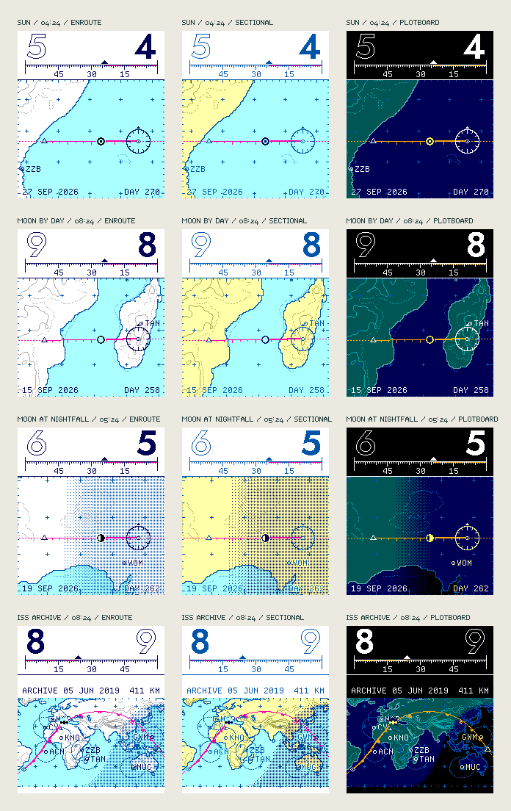

# Study 06 — Enroute

The Study 05 chart, redrawn in the language of aeronautical charts and of NASA's first mission control rooms. The references are the FAA sectional and IFR high-altitude enroute charts, the jet navigation charts of the 1960s, and the world-map plotboards used to follow Mercury, Gemini and Apollo. The goal is elegance through restraint: thin lines, a few inks and one strong figure.



## The chart's vocabulary

- **Relief.** Contour lines, not color bands. There is a solid line every 1,000 m, plus a dotted intermediate contour at 500 m. Heights are smoothed three times before contouring, so the lines read as drawn, generalized contours rather than grid cells. Flat hypsometric tints and two-tone hillshading were tried first; in 64 colors they looked like a school atlas or camouflage (see the exploration below).
- **The continental shelf.** A dotted blue line offshore is the real 200 m depth contour. It replaces Study 05's decorative waterline with data.
- **Graticule.** Small crosses every 5° (30° on the ISS world band). Degree ticks run around the edge of the map like a chart's neatline, with a longer tick every 5°.
- **The route.** The magenta line, which pilots follow on every glass cockpit. It is bold behind the marker, fine ahead and dashed before and after the hour. Ticks mark five minutes, with longer ticks labelled 15, 30 and 45 at the quarters, as on a plotted ground track.
- **Fixes.** This hour's station is a VOR: a hexagon inside a compass rose, with 30° ticks, longer cardinal ticks and a north arrowhead. The next hour is an open triangle, a reporting point. The map is north-up, so the rose shows true north, not magnetic variation.
- **The time scale.** The hour is read on a graduated scale across the top of the face, built like an instrument tape or the scale bar in a chart's margin. It is 180 px for 60 minutes, exactly three pixels a minute, so every graduation is evenly spaced. There is a mark every minute, longer marks every five minutes and at the quarters (labelled 15, 30 and 45), and tall hour marks at both ends. The two hour figures stand over those end marks at one size: this hour solid, the next in outline. A solid triangular index points at the present minute, and the hour already flown fills the scale in the route's color. The scale runs the way the route runs on the map, right to left for the Sun and Moon, so each end sits over its own station. An optional plain minute figure can be set over the index. The earlier radar-style data block and the minutes raised beside the hour were both tried and dropped.
- **Date.** The zoomed views print the local date and its day of the year in the bottom margin (`27 SEP 2026 · DAY 270`). The day of the year is how Mission Control's clocks counted days. The ISS margin keeps its archive date and altitude.
- **The present.** The body's own symbol: ☉ for the Sun, the Moon in its calculated phase, or a small station for the ISS.
- **The network.** Twenty-four stations of the Mercury (1961–63) and Apollo (1967–75) tracking networks, drawn as circled points with their network codes. Examples include TAN (Tananarive, Madagascar), ZZB (Zanzibar), CRO (Carnarvon) and GDS (Goldstone). When labels would collide, the station earlier in the list wins.
- **Acquisition circles.** On the ISS world band, each station also carries the circle within which a 410 km orbit rises 5° above its horizon, about 15.6° of arc. The circles are computed on the sphere, so they widen toward the poles, as they did on the Mercator plotboards.
- **Type.** The figures are set in Jost (SIL OFL 1.1), a revival of Futura, the face of the Apollo 11 plaque and many mission patches. Jost replaced Fira Sans after a side-by-side test on the face. Barlow (a DIN-style face) was the close second; Michroma was too wide for the figures at this size. The chart lettering (station codes, quarter-hour marks and margin notes) is [Departure Mono](https://github.com/rektdeckard/departure-mono) (SIL OFL 1.1). It is a pixel face drawn on an 11 px grid, so at 11 px every pixel is fully on or off. A double-size Departure minute set directly after the hour looked spindly. On the page, headlines use Michroma (after Microgramma, the lettering of 1960s space hardware), text uses Jost, and small type uses Departure Mono.
- **Honest margins.** The ISS view states `ARCHIVE 05 JUN 2019` and the station's altitude, because it is a bounded archive, not live data.
- **Night.** The paper plates print night as a regular dot screen under every symbol. The screen deepens from nothing at sunset to 25% at the end of civil twilight, which is how a printed chart would overprint a tint. The Plotboard keeps flat light zones.

## Live satellites

The ISS archive view stays, because it works offline and keeps the tests deterministic. Alongside it, the page can now track five satellites live:
- **ISS** and **Tiangong**, the two crewed stations;
- the **Hubble Space Telescope**;
- **Landsat 9**, sun-synchronous, so its passes cross each latitude at the same local time;
- **NOAA-20**, a polar weather satellite.

Choosing *Track now* fetches the satellite's current element set from CelesTrak and checks its checksums. The positions are then propagated with SGP4. Following CelesTrak's usage policy, a satellite's elements are requested at most once every two hours and cached in the browser. Elements are used only within three days of their own epoch. Beyond that the renderer refuses rather than guessing. If the request fails, the page says so; a stale cached copy can still be used if it is within three days. The margin names the element set in use (for example `HST EL 29 SEP 1336Z`), and uncrewed satellites get their own symbol, a body between two panels. *Now* brings any view to the current minute, and the face stays frozen until the next interaction.

On a watch, the phone would fetch and propagate the elements and send the watch compact trajectory knots, as measured in `docs/ENERGY.md`. The watch would never talk to CelesTrak.

This cloud build environment blocks celestrak.org, so the tests replace CelesTrak with an intercepted fixture: the 2019 ISS elements moved to the current epoch. Real requests happen only in a viewer's browser.

## Plates

| Plate | Reference | Paper | Lines | Type | Route |
| --- | --- | --- | --- | --- | --- |
| **Enroute** (default) | IFR enroute chart | white land, pale water | gray contours, cobalt coast | navy | magenta |
| **Sectional** | VFR sectional chart | cream land, pale water | olive contours, cobalt coast | cobalt | magenta |
| **Plotboard** | 1960s mission control display | teal land, dark water | cyan contours and coast | white | amber |

## Data

- **Relief:** `public/relief.bin` is a quarter-degree grid that lines up cell for cell with `public/land.bin` (1,036,800 bytes). It uses square-root codes: 0–63 is depth to 11,000 m and 64–255 is height to 8,850 m. `npm run generate:relief` rebuilds it from the AWS Open Data Terrain Tiles (Tilezen Joerd) at zoom 3. At that zoom, the tiles' own source headers list only NOAA ETOPO1 and USGS GMTED2010, both in the public domain. The generator records those headers in `data/relief.json` and refuses to write the grid if any other source appears. Checks cover the Tibetan plateau, the Altiplano, the Amazon basin, the Netherlands, the Mariana Trench, and agreement with the coastline atlas, where 99.7% of land cells have non-negative height. The grid is generalized and **not for navigation**.
- **Tracking stations:** `data/tracking-stations.json` holds positions rounded to about 0.1° from public histories of the networks. They place a symbol, not a survey point.
- **Everything else** carries over from Study 05: Astronomy Engine for the Sun and Moon, the bounded 2019 Satellite.js ISS archive, Natural Earth coastlines, and the Dymaxion bitmap tooling. The type is Jost, Michroma and Departure Mono, all SIL OFL 1.1.

## The exploration

Six terrain treatments were compared on four scenes: the Horn of Africa, the Himalaya, the Andes coast and Western Australia. These were 64-color layer tints, contours only, tints with contours, two-tone shaded relief, white-paper contours, and tints with shading. Layer tints turned into loud bands of lime, orange and brown. Shaded relief at a quarter-degree read as camouflage. Contours on plain paper were the only treatment that stayed quiet at 1× and still showed where the high ground is.

Several other choices were tried and then cut back:
- Interior graticule crosses were reduced from 7 to 5 pixels.
- A coordinate line along the bottom edge was dropped as clutter.
- The first figure size (104 px) was reduced to 80 px.
- A flat night zone on paper was replaced by the dot screen.

## Cost

In Node on a desktop CPU, a new hour takes about 120 ms (projection, coast, relief smoothing), a new minute about 25 ms, and a plate change about 20 ms. **These are not watch measurements.** The relief grid is also too large to load into watch RAM. A native design would let the phone render the hour's base chart (coast, contours, shelf and graticule) into a compact indexed bitmap and send it once an hour. The watch would then draw only the route, marker, stations, night screen and figures each minute. None of this has been profiled, and no battery claim is made.

## Open questions

- One-pixel gray contours and a 25% dot screen need checking on the reflective display, in daylight and under the backlight.
- The tracking-station layer may belong behind a setting. It delights on the ISS band but is optional on the Sun and Moon faces.
- The compass rose could show magnetic variation from a world magnetic model, as real VOR roses do. That would take an extra model and would not help anyone read the time.

## Verification

```sh
npm test                        # includes tests/enroute.test.mjs
node tests/enroute-browser.mjs  # part of npm run test:browser
npm run proofs                  # regenerates the Study 05 and 06 PNGs without a browser
```

Unit tests cover the following:
- the relief grid's sources, encoding and known places;
- contour placement, on real terrain and on a synthetic cone;
- native RGB222 output for every plate, body and clock format;
- the hour, minute and next hour for all 24 hours in both formats, with the figures clear of the rose, the route and each other;
- marker progress through every minute;
- tracking stations in view with labels that do not collide, and the acquisition radius;
- the night screen's density (under 1% by day, 25% ± 4% at night);
- the ISS world band, and cache reuse.

The browser check confirms that the watch and all three proofs show the renderer's exact pixels in 18 combinations. It also checks the controls, moonlight, clock zones, zero idle redraws and 320/390-pixel layouts.
